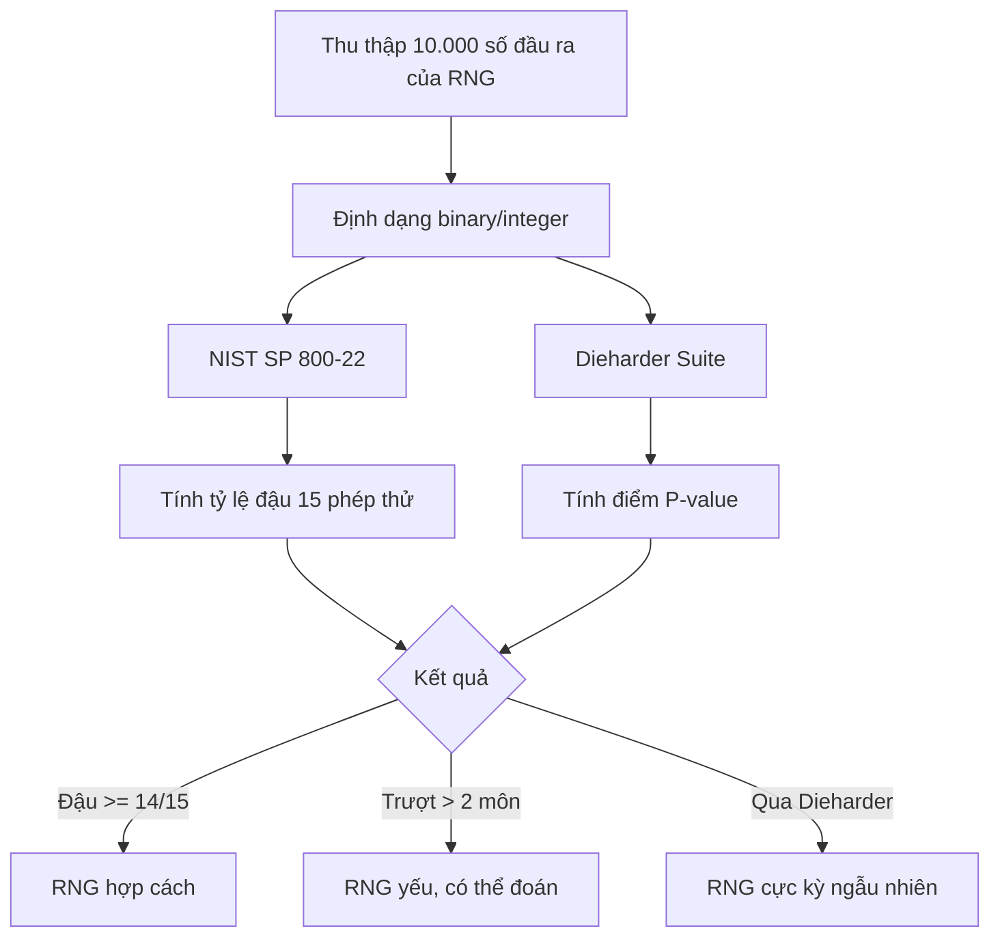

# Khai Sáng Thiên Cơ (Đệ Nhất Bản)

> _"Vạn pháp quy về Xác Suất, thiên cơ tận tại Random. Ngã độc tôn nhất đạo, dùng Code để ngộ Đạo."_

**Pháp hiệu tác giả:** `ThienThuongThienHa_DuyNgaDocTon`

**Thể loại:** Pet Project giải khuây - hóa giải tà khí Burnout bằng Xác Suất Thống Kê & Python/Go.

---

## Tông Chỉ

Đây không phải bí kíp chỉ đường mua vé số. Đây là bí kíp dùng Code để chém vào ba tầng huyền bí:

| Tầng | Ý nghĩa                                                          |
|---|------------------------------------------------------------------|
| **Vận** | May mắn có thật hay chỉ là ảo giác thống kê ?                    |
| **Thiên Cơ** | Hỗn mang (Random) vận hành theo quy luật nào ?                   |
| **Nhân Quả** | Họa - Phúc có tương quan, hay chỉ là cái nhãn con người tự dán ? |

**Tuyên ngôn Chính Đạo:** Bí kíp này **KHÔNG** dùng để mua vé số, tìm đường làm giàu, hay tham gia canh bạc trần đời. Chỉ dùng để giải trí trí tuệ và luyện công phu Data Science.

---

## Tứ Đại Trận Pháp

### Trận Pháp 1 - Vạn Kiếp Quy Tông (Monte Carlo Simulator)
_"Chọn số đẹp không làm tăng Thiên Mệnh, nhưng sẽ khiến tiền thưởng bị phân tán như cát bụi."_
Mô phỏng hàng triệu kiếp người mua vé, so tài phe Tình Cảm (chọn ngày sinh, số đẹp) với phe Vô Vi (random thuần túy). **Chân lý hé lộ:** xác suất trúng như nhau, nhưng trúng theo ngày sinh thì dễ phải chia giải với hàng ngàn đồng đạo cùng gu.

Chạy thử:
```bash
python -m src.tran_phap_1_monte_carlo.run
```
Chi tiết kỹ thuật & tùy chỉnh tại [`src/tran_phap_1_monte_carlo/README.md`](src/tran_phap_1_monte_carlo/README.md).

`src/tran_phap_1_monte_carlo/`

### Trận Pháp 2 - Lão Tặc AI, Kẻ Học Vẹt (Overfitted Prophet)
_"AI tưởng mình thông thiên, nhưng trước Random chỉ là một thằng học vẹt."_
Nuôi một con quái vật Machine Learning, nhồi 10 năm lịch sử quay số, ép nó overfit đến độ tự tin 99.9%. Rồi cho nó vả mặt vào thực tế.

Chi tiết kỹ thuật [`src/tran_phap_2_overfit_ai_/README.md`](src/tran_phap_2_overfit_ai/README.md)

`src/tran_phap_2_overfit_ai/`

### Trận Pháp 3 - Phá Giải Hỗn Mang (Chaos vs. PRNG)
_"Hỗn mang có quy luật, nhưng Xổ Số là bậc thầy của vô thường."_
Vẽ trận đồ Lorenz Attractor, đối chiếu với PRNG máy tính, để phân biệt hỗn loạn có trật tự (deterministic chaos) và ngẫu nhiên thật.

Chi tiết kỹ thuật [`src/tran_phap_3_chaos_prng/README.md`](src/tran_phap_3_chaos_prng/README.md)

`src/tran_phap_3_chaos_prng/`

### Trận Pháp 4 - Bàn Cờ Nhân Quả (Quantifying Luck)
_"Trong họa có phúc, trong phúc có họa. Cả hai đều là... label của con người."_
Ma trận tương quan giữa biến cố A (Trúng Jackpot) và B (Tai họa), dùng dữ liệu "Lottery Curse" từ Mỹ/Âu.

Chi tiết kỹ thuật [`src/tran_phap_4_hoa_phuc/README.md`](src/tran_phap_4_hoa_phuc/README.md)

`src/tran_phap_4_hoa_phuc/`

---

## Chi Nhánh Phụ - Kiếp Nạn RNG (RNG Kiểm Định)

Kiểm định xem một bộ sinh số ngẫu nhiên (LCG, Mersenne Twister, TRNG, CSPRNG) là "yêu quái tầm thường" hay "thần tiên chính thống", bằng hai pháp bảo:

| Pháp Bảo | Công Dụng |
|---|---|
| **NIST SP 800-22** | 15 phép thử thống kê (Frequency, Runs, Serial...) |
| **Dieharder Suite** | 31 phép thử nặng đô của George Marsaglia |



`src/rng_kiem_dinh/`

---

## Statistical Adversary - Đối Thủ Phản Biện (chạy trên Gemini API)

_"Kết luận nào chưa từng bị vặn hỏi, kết luận đó chưa đáng tin."_

Sau khi chạy xong bất kỳ Trận Pháp nào trên Đạo Đài (Dashboard), một khu  vực **Statistical Adversary** sẽ xuất hiện bên dưới kết quả. 
Bấm **"Triệu Hồi Đối Thủ"**, kết quả (tham số đầu vào + số liệu đầu ra) sẽ được gửi cho Gemini, đóng vai một đồng nghiệp phản biện khó tính chuyên soi lỗ hổng thống kê: cỡ mẫu, ý nghĩa thống kê vs. ý nghĩa thực tế, giả định mô hình, rủi ro p-hacking, tính tổng quát hoá, nhạy cảm seed...

Đạo hữu có thể gõ giải trình vào ô bên dưới để **bảo vệ** kết luận của mình - Đối Thủ sẽ đánh giá thẳng thắn xem lập luận có đứng vững hay không, giống như một buổi bảo vệ luận văn thu nhỏ.

**Kích hoạt tính năng:**

1. Lấy API key miễn phí tại [Google AI Studio](https://aistudio.google.com/apikey).
2. Chạy local: sao chép `.streamlit/secrets.toml.example` thành `.streamlit/secrets.toml` rồi điền key vào (file này đã bị `.gitignore` chặn, không lo lộ key khi commit).
   ```toml
   GEMINI_API_KEY = "key-that-cua-ban"
   ```
3. Deploy trên Streamlit Community Cloud: vào **App > Settings > Secrets**, dán đúng dòng trên vào ô Secrets.
4. Chạy bằng Docker: truyền biến môi trường khi `docker run`:
   ```bash
   docker run -e GEMINI_API_KEY=key-cua-ban -p 8080:8080 khai-sang-thien-co
   ```

**Lưu ý:**
Nếu chưa cấu hình key, khu vực Statistical Adversary vẫn hiển thị nhưng sẽ báo rõ cần làm gì thay vì báo lỗi khó hiểu - Dashboard vẫn dùng được bình thường mà không cần tính năng này.

`src/statistical_adversary/` (logic gọi Gemini API) +
`dashboard/adversary_widget.py` (UI dùng chung cho cả 4 trận pháp)

---

## Sơ Đồ Đạo Quán (Cấu Trúc Thư Mục)

```
khai-sang-thien-co/
├── README.md                       # Bí kíp này
├── requirements.txt                # Danh sách nội công tâm pháp (dependencies)
├── .gitignore
├── LICENSE
│
├── data/
│   ├── raw/                        # Dữ liệu quay số thô, chưa luyện
│   └── external/                   # Dữ liệu mượn (Lottery Curse dataset...)
│
├── src/                            # Nội tạng bí kíp
│   ├── tran_phap_1_monte_carlo/    # Mô phỏng Monte Carlo
│   ├── tran_phap_2_overfit_ai/     # Model AI học vẹt
│   ├── tran_phap_3_chaos_prng/     # Lorenz Attractor & PRNG
│   ├── tran_phap_4_hoa_phuc/       # Ma trận tương quan Họa-Phúc
│   ├── rng_kiem_dinh/              # NIST SP 800-22 / Dieharder runner
│   └── statistical_adversary       # Ông bạn đồng nghiệp khó tính
│
│
├── notebooks/                        # Nơi thử nghiệm, luyện công lặt vặt
├── dashboard/                        # Đạo Đài Streamlit - nơi chiêm ngưỡng chân lý
│   └── app.py
├── tests/                            # Kiểm chứng công phu (unit tests)
└── docs/                             # Bí kíp gốc, ghi chú thêm
    └── bi_kip_goc.md
```

---

## Nhập Môn (Cài Đặt)

```bash
# Sao chép bí kíp về hang động của bạn
clone repo về

cd khai-sang-thien-co

# Luyện nội công tâm pháp (cài dependencies)
pip install -r requirements.txt

# Khai mở Đạo Đài
streamlit run dashboard/app.py
```

---

## Kiếp Nạn Đã Lường Trước

| Kiếp Nạn | Đạo Tình | Giải Pháp |
|---|---|---|
| **Sức Mạnh Của Con Rùa** | Máy tính già, 1 tỷ vòng Monte Carlo bằng Python thuần có thể khiến người chờ đến tắt thở | Vector hóa bằng **Numpy**, hoặc chuyển sang **Golang** (goroutines) nếu cần song song hóa cực mạnh |
| **Cải Trang Dữ Liệu** | Không có data người trúng số Việt Nam để soi "họa sau phúc" | Mượn dataset công khai về Lottery Curse ở Mỹ/Châu Âu |

### Ghi chú cho máy cấu hình vừa/yếu

Trận Pháp 1 đã được đo trên máy tương đương **CPU 8 luồng ~2.5GHz, 8GB RAM**:
mặc định (2 triệu vé/phe) chạy khoảng **5-6 giây, đỉnh RAM chỉ ~350MB** -
hoàn toàn nhẹ nhàng, không cần lo "chờ đến tắt thở" như bí kíp gốc dọa.
**Bí quyết:** sinh vé vector hóa hoàn toàn bằng numpy (không for-loop qua
từng vé) + chia lô (chunk) để không tràn RAM dù tăng số vé lên bao nhiêu.
Muốn nhẹ hơn nữa hoặc mạnh hơn, chỉnh `--n-players` và `--chunk-size` khi
chạy (xem README của module).

---

## Bí Kíp Gốc

Bản thảo ý tưởng đầy đủ (văn phong tán tu nguyên bản) nằm tại [`docs/bi_kip_goc.md`](docs/bi_kip_goc.md).

---

_Tu luyện vui vẻ, đừng tẩu hỏa nhập ma._
